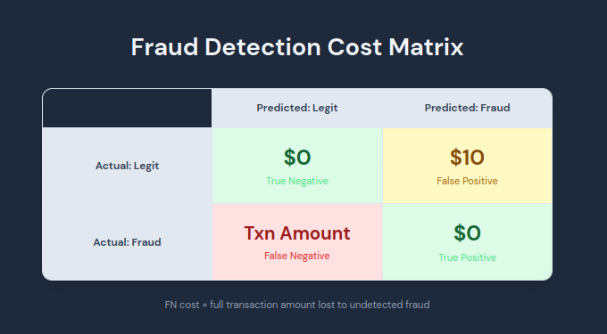
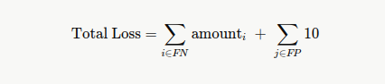
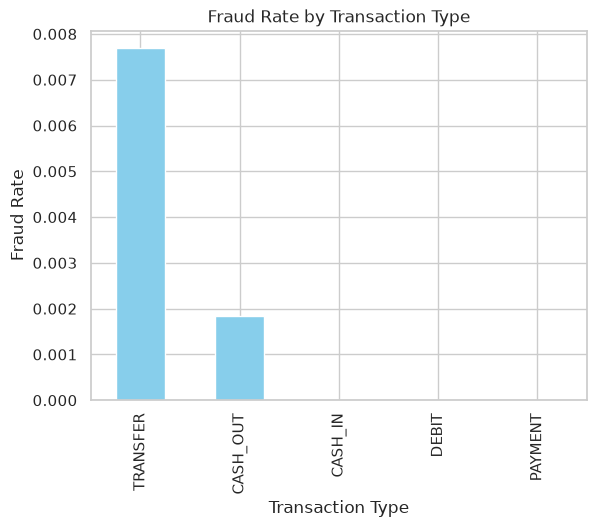

# Mobile Money Fraud Detection

## 1. Business Context

### 1.1 Problem Statement
Fraudulent transactions drain customer accounts, causing direct financial loss (chargeback liability), customer churn from broken trust, and operational costs from manual reviews — the current rule-based system (isFlaggedFraud) catches only 0.19% of fraud, leaving the business exposed.

### 1.2 Actors
- **Victim:** The mobile money account holder. Their balance is reduced or emptied without consent. For many users, mobile money is a primary financial tool — losing access means losing funds needed for daily life.
- **Attacker:** An adversarial actor who gains unauthorized control of a customer's account for financial gain. They capture gains while the victim and business absorb the losses. Their identity is unobservable in the data — only their effects on transaction patterns are visible.
- **Business:** The mobile money operator. Absorbs direct financial loss (reimbursements), operational costs (investigation teams, support), regulatory exposure, and reputational damage.

### 1.3 Fraud Pattern
PaySim's fraud follows one specific mechanism: the attacker takes control of a customer's account and executes a two-step sequence:
1. **TRANSFER** — moves money out of the victim's account into a mule account, typically draining the full balance
2. **CASH_OUT** — immediately withdraws the money as physical cash, making it untraceable before the fraud is detected

### 1.4 Business Impact
Each undetected fraud costs = **full transaction amount + investigation cost + reputational damage**. We use the amount as our FN cost proxy, knowing the real cost is higher.

## 2. Project Objective

Build a binary classifier that predicts the probability of fraud **before the transaction is approved**, using a decision threshold that minimizes total financial loss — not accuracy or F1.

## 3. Why ML?

The current rule-based system (`isFlaggedFraud`) catches only **16 out of 8,213 frauds (0.19%)**. A simple rule like "flag transactions over $200k" misses almost everything — especially moderate amounts that blend in with legitimate activity. ML can learn complex patterns (balance errors, velocity, transaction sequences) that rules can't capture.

## 4. Cost Matrix

**FN cost** = full transaction amount (variable — the company absorbs 100%)

**FP cost** = $10 USD (estimated operational cost of manual review + customer friction — documented assumption, adjustable by the business)

**Total Cost Formula:**

## 5. Dataset & Limitations

**Dataset:** PaySim synthetic mobile money transactions (`creditcardFraud.csv`)

### 5.1 Limitations
- **Synthetic data** — not real transactions. Fraud patterns follow simulator rules, so a model may perform perfectly here but fail on real data.
- **Simplistic fraud patterns** — fraud only occurs in TRANSFER and CASH_OUT types. Never in PAYMENT, DEBIT, or CASH_IN. Real fraud is more diverse.
- **No geography, merchant, or device data** — can't analyze by location, merchant category, IP, or device fingerprint.
- **No customer history** — no transaction frequency, velocity per user, or spending patterns (only per-row balance snapshots).
- **Time is simulated (step)** — 743 steps = 1 hour each ≈ 31 days. No real day-of-week or seasonality effects.
- **Obvious fraud signature** — `oldbalanceOrg - amount = newbalanceOrig` almost perfectly in fraud cases. A simple rule catches most of it. Real fraud is subtler.

## 6. EDA Summary

- **0 nulls**, **0 exact duplicates**
- **11 columns**, **6,362,620 rows** (534 MB)
- Fraud rate: **0.13%** (8,213 frauds out of 6.3M)
- Fraud only in **TRANSFER** and **CASH_OUT** transaction types

- Flagged fraud system (`isFlaggedFraud`) detects only **16 out of 8,213**
- No negative amounts or balances — data is consistent
- Balance inconsistency (`oldbalanceOrg - amount ≠ newbalanceOrig`) is **rare in legit, common in fraud** — strong predictive signal

## 7. ML Models

### 7.1 Logistic Regression

**First approach:**
1. `class_weight='balanced'` — the dataset is heavily imbalanced (0.13% fraud, 99.87% legit). This assigns higher weight to the minority class (fraud), penalizing the model more when it misses fraud than when it flags a legit transaction.
2. One-hot encoding for `type` + StandardScaler for numeric features, chained in a Pipeline.
3. **93% recall** for fraud (catches 93/100), but **2% precision** (98 out of 100 fraud alerts are wrong), causing ~4,500 false positives.

**Analysis:** The model catches most frauds, but the high false positive rate is costly. Next steps: tune the decision threshold using the cost matrix, add better features (balance differences, velocity), and try tree-based models.
